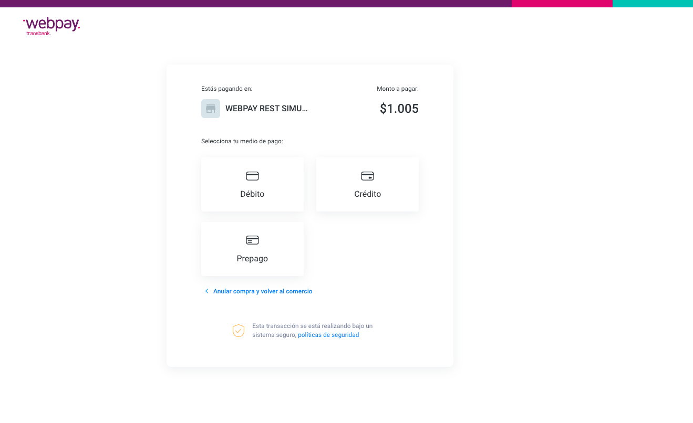
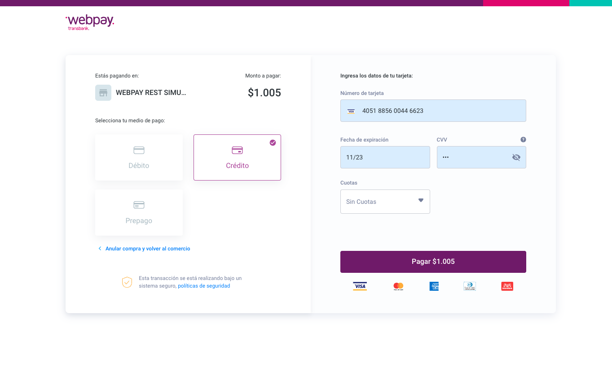
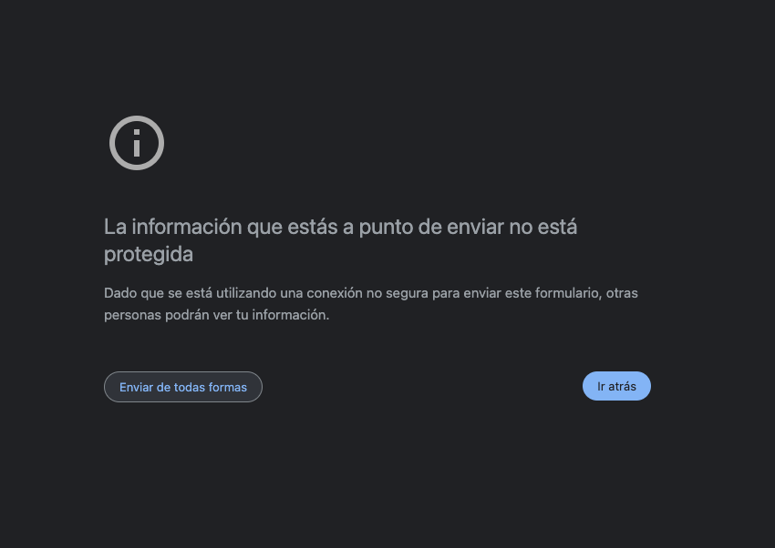

# Manual de instalación para Plugin Magento2

## Descripción

Este plugin oficial ha sido creado para que puedas integrar Webpay fácilmente en tu comercio, basado en Magento2.

## Requisitos

1. Debes tener instalado previamente Magento2 y asegurarte de tener [Composer](https://getcomposer.org) instalado.
2. Tus credenciales de Magento Market a mano. Si no sabes cuales son tus credenciales puedes revisar esta guia: [https://devdocs.magento.com/guides/v2.2/install-gde/prereq/connect-auth.html](https://devdocs.magento.com/guides/v2.2/install-gde/prereq/connect-auth.html)

Habilitar los siguientes módulos / extensiones para PHP:
- Soap
- OpenSSL 1.0.1 o superior
- SimpleXML
- DOM 2.7.8 o superior

## Instalación del Plugin

**Nota:** En este punto composer podría pedirte si lo requiere tus creedenciales de magento2.

**Versiones disponibles** [Aquí](https://packagist.org/packages/transbank/webpay-magento2)

En tu directorio de Magento2, ejecutar el siguiente comando para instalar la última versión:

    composer require transbank/webpay-magento2

  

Cuando finalice, ejecutar el comando:

    magento module:enable Transbank_Webpay --clear-static-content

  

Cuando finalice, ejecutar el comando:

    magento setup:upgrade && magento setup:di:compile && magento setup:static-content:deploy

  
  
Una vez realizado el proceso anterior, Magento2 debe haber instalado el plugin Webpay. Cuando finalice, debes activar el plugin en el administrador de Magento2.

## Configuración

Este plugin posee un sitio de configuración que te permitirá ingresar credenciales que Transbank te otorgará y además podrás generar un documento de diagnóstico en caso que Transbank te lo pida.

Para acceder a la configuración, debes seguir los siguientes pasos:

1. Dirígete a la página de administración de Magento2 (usualmente en http://misitio.com/admin, http://localhost/admin) e ingresa usuario y clave.

  
  
2. Dentro del sitio de administración dirígete a (Stores / Configuration).

  

3. Luego a sección (Sales / Payments Methods).

  

4. Elegir el país Chile

  

5. Bajando al listado de métodos de pagos verás Webpay

  

6. ¡Ya está! Estás en la pantalla de configuración del plugin, debes ingresar la siguiente información:
  * **Enable**: Al activarlo, Webpay estará disponible como medio de pago. Ten la precaución de que se encuentre marcada esta opción cuando quieras que los usuarios paguen con Webpay.
  * **Ambiente**: Ambiente hacia donde se realiza la transacción. 
  * **Código de comercio**: Es lo que te identifica como comercio.
  * **Llave Privada**: Llave secreta que te autoriza y valida a hacer transacciones.
  * **Certificado Publico**: Llave publica que te autoriza y valida a hacer transacciones.
  * **Certificado Webpay**: Llave secreta de webpay que te autoriza y valida a hacer transacciones.

  Las opciones disponibles para _Ambiente_ son: "Integración" para realizar pruebas y certificar la instalación con Transbank, y "Producción" para hacer transacciones reales una vez que Transbank ha aprobado el comercio.
  
### Credenciales de Prueba

Para el ambiente de Integración, puedes utilizar las siguientes credenciales para realizar pruebas:

* Código de comercio: `597020000540`
* Llave Privada: Se puede encontrar [aquí - private_key](https://github.com/TransbankDevelopers/transbank-webpay-credenciales/blob/master/integracion/Webpay%20Plus%20-%20CLP/597020000540.key)
* Certificado Publico: Se puede encontrar [aquí - public_cert](https://github.com/TransbankDevelopers/transbank-webpay-credenciales/blob/master/integracion/Webpay%20Plus%20-%20CLP/597020000540.crt)

1. Guardar los cambios presionando el botón [Save Config]

  

2. Además, puedes generar un documento de diagnóstico en caso que Transbank te lo pida. Para ello, haz click en "Parametros Principales" botón "Información" ahí podrás descargar un pdf.

  

## Configuración de magento2 para Chile CLP

El plugin solamente funciona con moneda chilena CLP dado esto magento2 debe estar correctamente configurado para que que se pueda usar Webpay.

1. Ir a la sección de administración (Stores / General / Country Option) y elegir Chile tal como se muestra en la siguiente imagen, luego guardar los cambios.

  

2. Ir a la sección de administración (Stores / Currency Setup / Country Option) y elegir Chile tal como se muestra en la siguiente imagen, luego guardar los cambios.

  

3. Ir a la sección de administración (Stores / Currency) y verificar en las dos secciones (Currency Rates y Currency Symbols) que CLP se encuentre activo.

  

  

  

## Prueba de instalación con transacción

En ambiente de integración es posible realizar una prueba de transacción utilizando un emulador de pagos online.

* Ingresa al comercio

  

* Ya con la sesión iniciada, ingresa a cualquier sección para agregar productos

  

* Agrega al carro de compras un producto:

  

* Selecciona el carro de compras y luego presiona el botón [Proceed to Checkout]:

  

* Selecciona método de envío y presiona el botón [Next]
  
  Debes asegurarte que tu dirección de envio sea en Chile.

  

* Selecciona método de pago Transbank Webpay, luego presiona el botón [Place Order]

  

* Una vez presionado el botón para iniciar la compra, se mostrará la ventana de pago Webpay y deberás seguir el proceso de pago.

Para pruebas puedes usar los siguientes datos:  

* Número de tarjeta: `4051885600446623`
* Rut: `11.111.111-1`
* Cvv: `123`
  

Para pruebas puedes usar los siguientes datos:  

* Rut: `11.111.111-1`
* Clave: `123`

Puedes aceptar o rechazar la transacción

  
* Serás redirigido a Magento2 y podrás comprobar que el pago ha sido exitoso.

 

* Además si accedes al sitio de administración sección (Sales / Ordes) se podrá ver la orden creada y el detalle de los datos entregados por Webpay.

 

 

 
